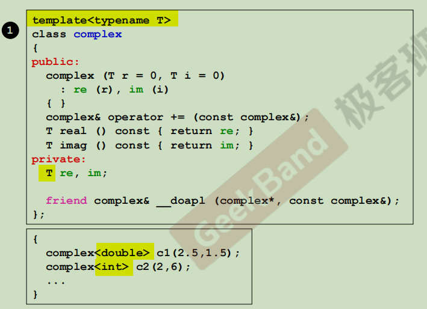

# 01_C++面向对象上

><mark>目标：</mark>
>>1. 培养正规的、大气的编成习惯
>>2. 以良好的方式编写C++ class ——基于对象(Object Based)。例子如下：
    - class without pointer member -- Complex
    - class with pointer menmber -- String
>>3. 学习Classes之间的关系——面向对向(Object Oriented)
    - 继承(inheritance)
    - 复合(composition)
    - 委托(delegation)
    
---

</br>

## 01.1 **C vs C++ 关于数据和函数**
- 在C中创建的数据变量是全局的，创建的各个函数都可以去访问这些数据变量。


- 在C++中将数据和处理数据的函数封装在一起；也就说这个数据只有它对应的函数去处理它，也就是类(class)实例化的对象来调用函数处理数据。
    

---

<br/>

## 01.2 **基于对象(Object Based) vs 面向对象(Object Oriented)**
- Object Based：面对的是单一class的设计。
-  Object Oriented：面对的是多重classes的设计，classes和classes之间的关系。
    
## 01.3 **Header(头文件)中的防卫式声明**

<mark>complex.h</mark>
```c
#ifndefin _COMPLEX_
#define _COMPLEX_

...

#endif
```


---

## 01.4 **类(class)**
### 01.4.1 class的声明(declaration)
- 包含类头、类体

       
### 01.4.2 class template(模板)简介  
- **使用模板的一个好处是数据类型未定，当使用者要用时再指定。**


### 01.4.3 内联(inline)函数
- 是不是inline函数还是要看编译器有没有能力把它做成inline。

    

### 01.4.4 访问级别(access level)
- 数据的部分是私有的；
- 函数可以是私有的，也可以是公开的可以被外界使用的；


### 01.4.5 构造函数(constructor)


- 使用者如果要创建一个对象，**构造函数不被调用就自动调用起来了**；
- **构造函数名称与类名称一致；且没有返回值**，因为构造函数是来创建对象的
- 构造函数有默认值，是说在创建对象时没有**指明**变量就使用默认值；若有**指明**就使用我们自己指明的值。
- **构造函数特别的语法**（只用构造函数有）：初始化列表
- **初始化和赋值的区别**：一个对象的数值的设定有两个阶段，一是在<mark>" : "后面初始化</mark>，二是后面在<mark>"{ }"内再赋值 </mark>。
        
### 01.4.6 构造函数可以有很多个重载(overloading)


- 重载：按照使用者需求有**多种初值的设定**，这使得同名函数可以同时存在。<mark>在编译器的角度来看，他们是不同名的。</mark>
- 函数重载常常发生在构造函数身上。
- 重载函数可能会有冲突的情况，上图中的两个构造函数就冲突了。

### 01.4.7 把构造函数放在private里
>外界不可以调用构造函数；
>会有这样的需求，如单例模式下：


### 01.4.8 const member functions （常量成员函数）
>类里面的“成员函数”有会改变数据内容的，和**不会改变数据内容的**，<mark>对于后者加const</mark>；
>>const可能出现在**“函数”后面**，意思是**不改变数据**；也可能出现在**“对象或者变量的前面”**意思是说**“变量或者对象的内容不变”**。**“对象或者变量的前面”加const时，函数后面一定加const**。


### 
